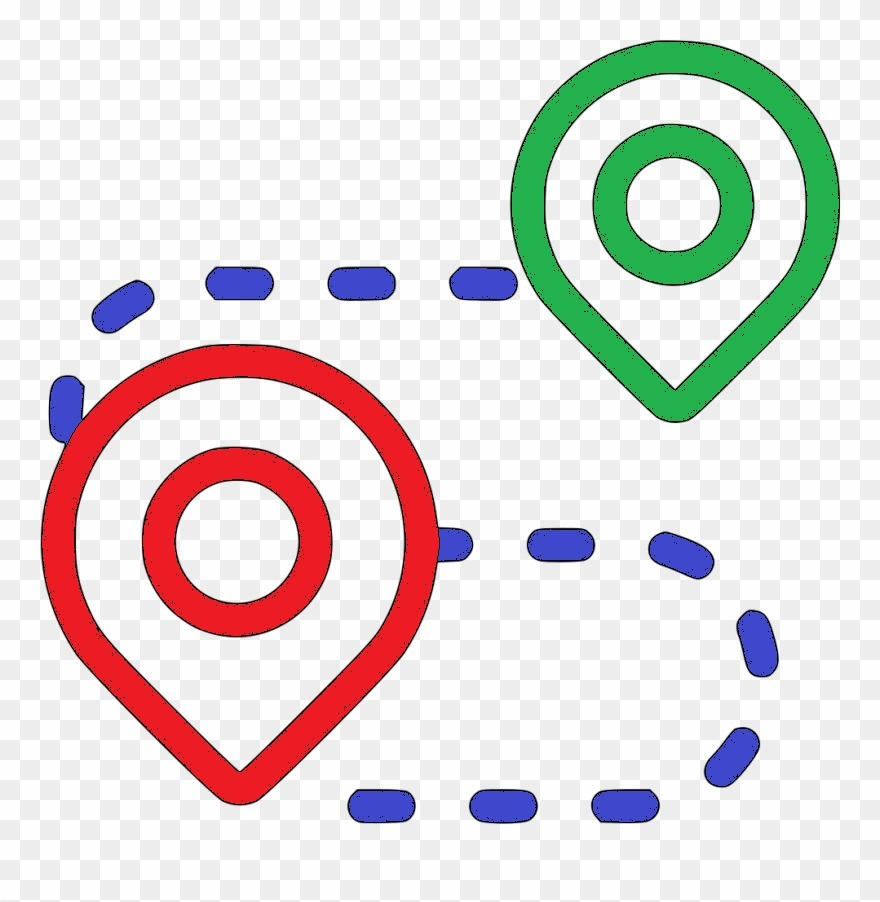

# Graph-Visualizer
This repository features various path-finding and maze generation algorithms in a grid.

# What are pathfinding algorithms?
<i>Pathfinding algorithms are the class of algorithms that usually attempt to solve the shortest path problem in graph theory. They try to find the best path given a starting point and ending point based on some predefined criteria.</i>

# What is Pathfinder?

<i>This visualizing tool shows how different pathfinding algorithms work. The basic idea of it is to begin from the 'Start' and reach the 'Goal' node. A node's horizontal and vertical neighbours are considered the valid neighbours i.e. only UP, DOWN, LEFT, RIGHT movements are allowed (no diagonal crossing). 

Once any algorithm starts searching for the goal node, the visited nodes would be marked in orange color. The algorithm runs untill the goal node is reached or the entire grid is searched. If the path is found it will be marked with blue color.</i>

# Select an algorithms!

<i>Here we primarily have two classes of algorithms: <b>weighted</b> and <b>unweighted</b>.</i>
* <b>Weighted</b>: These category of algorithms consider the weights of nodes while searching for the goal node.
* <b>Unweighted</b>: These algorithms don't consider the weights of nodes while searching for the goal node.

<i>Also all the algorithms doesn't guarantee the shortest path. You can pick an algorithm from the algorithm drop down menu to visualize it.</i>

# Draw walls and weights

&nbsp; &nbsp;

<i>You can manipulate the grid according to your wish. If a node is marked as 'Wall' node, then it is not walkable. Weight on the otherhand is a 'walkable' node but you will cost you 5 units (walking through an empty node will cost 1 unit).

You can create walls or weights by clicking on the grid and dragging over it. You can easily switch between walls and weights from the header. Once you are done just hit 'Visualize' button!</i>

# Generate mazes!

<i>You can play around with mazes to see how the pathfinder locates the goal node inside a maze. You can modify the mazes (by adding walls and weights at the choke points) to see how the path course for the algorithm changes. The standard mazes like recursive division, flood fill, kruskal's and prim's maze are implemented.</i>

# Running time and shortest path

<i>I have tried to implement the execution time of the algorithm and tried to make the running time as accurate as possible, but still some of the CPU time is consumed is animation of grid.

We also have an additional functionality 'Compare' where you can see the running time of all the algorithms side by side with its path cost (I have not included the Jump point search algorithm for comparision here because an ideal Jump point search algorithm involves diagonal movements aswell. It thrills in such condition, poor Jump point search).</i>

# Others
<i>There are some other small features to assist in visualization like: speed change, clearing grid, movable Start and Goal node, etc. I hope you will enjoy playing with it. If you find any issue or unusual behaviour feel free to let me know.</i>

Liked this? You may also like the related project <a href="https://abhishek1152.github.io/sorting-visualizer/">sorting visualizer</a>.
